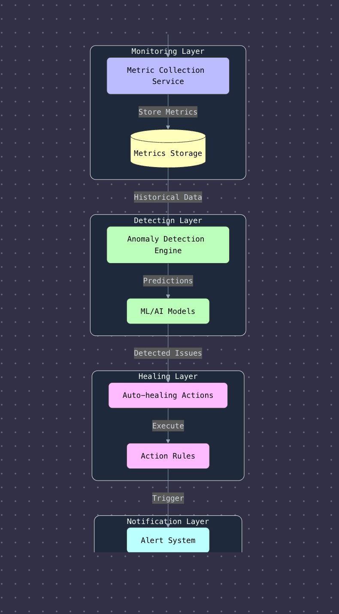
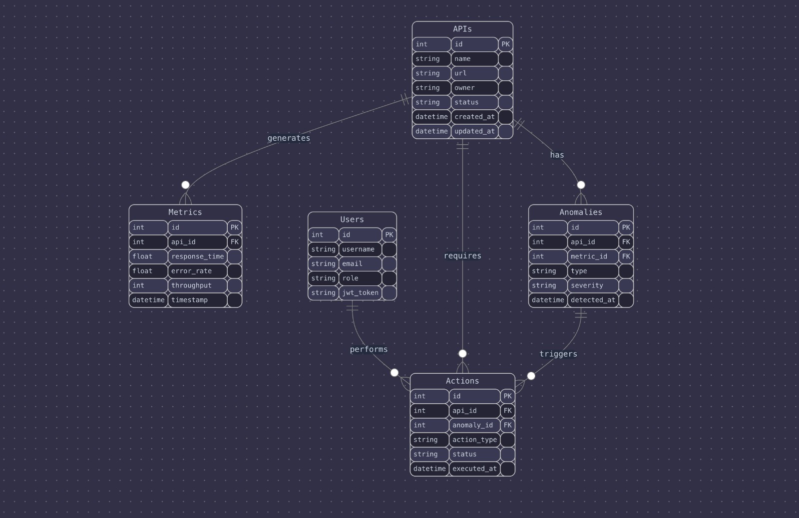
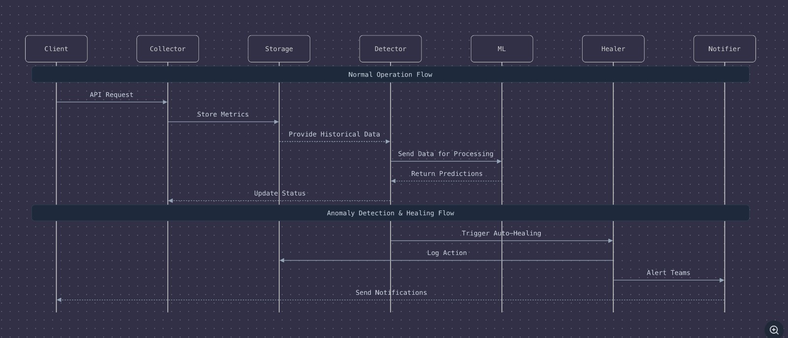
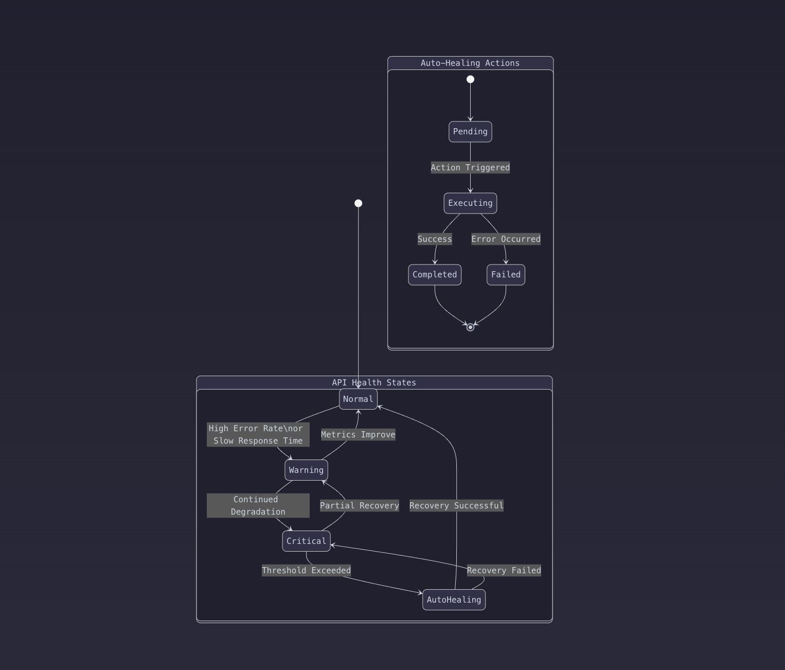

# Project Diagrams

This folder contains all architecture, flow, and data model diagrams for the Intelligent API Monitoring & Auto-Healing System.

---

## 1. `architecture.png` - High-Level Architecture Flow

- **Purpose:** Shows the overall system layers: Monitoring, Detection, Healing, and Notification.
- **Description:** Visualizes how metrics flow from collection → anomaly detection (via ML/AI) → healing actions → alerting. Each layer is modular and event-driven.

---

## 2. `er-diagram.png` - Entity-Relationship (Database) Diagram

- **Purpose:** Defines the core database structure.
- **Description:** Outlines tables/entities: APIs, Metrics, Anomalies, Users, and Actions; shows how they are connected (e.g., Metrics belongs to APIs, Actions relate to Anomalies, etc). Use this as reference for ORM/entities setup.

---

## 3. `sequence.png` - Sequence Diagram

- **Purpose:** Shows runtime flow/interactions between main components.
- **Description:** Explains both normal operation (API metric ingestion/processing) and exception flow (detecting anomalies, triggering healing, alerting teams). Clarifies what each module is responsible for and how they interact step by step.

---

## 4. `state-diagram.png` - API Health & Auto-Healing State Diagram

- **Purpose:** Visualizes state transitions for API health and healing actions.
- **Description:** Details possible API states (Normal, Warning, Critical), triggers for auto-healing, and action outcome states (Pending, Executing, Completed, Failed). Helps with logic coding for status checks and auto-heal workflows.

---

**Use these diagrams for architecture reference, onboarding, and further project extension.**
